# Timero

Timero is a terminal-based workout assistant that helps you stay on track with your exercise routine. With Timero, you can create structured routines that include both timed and repetition-based exercises.

During a workout session, Timero guides you through each exercise in the correct order, automatically starting breaks and timers so you can focus on your workout — no need to count in your head. Whether you're training at home or in the gym, Timero ensures you complete your routine with precision and ease.

## Table of Contents
* [Timero](#timero)
   * [Build With](#build-with)
   * [Installation](#installation)
   * [Usage](#usage)
      * [Navigating the app](#navigating-the-app)
      * [Exiting the app](#exiting-the-app)
   * [Screenshots](#screenshots)
      * [Routine Selection](#routine-selection)
      * [Creating New Routine](#creating-new-routine)
      * [Editing Exercise](#editing-exercise)
      * [Workout Session](#workout-session)
      * [Settings](#settings)
   * [FAQ](#faq)

<!-- Created by https://github.com/ekalinin/github-markdown-toc -->

## Build With

- **Python** – The core programming language powering Timero.
- **[Textual Framework](https://textual.textualize.io/)** – Provides the rich Terminal UI (TUI).
- **Love & Passion <3** – Because great projects are built with heart.


## Installation
To run this repo you will need all the packages listed in `requirements.txt`, so install them first.

```bash
# Install dependencies
pip install -r requirements.txt
```

Then clone this repo:

```bash
# Clone this repository
$ git clone https://github.com/Brydzzz/timero.git

# Navigate into repository
$ cd timero
```
## Usage
There are a couple of ways you can start the app:

> ❗ Make sure you are in the cloned repo folder

```bash
# With python
$ python src/timero.py

# With textual
$ textual run src/timero.py

# Or serve the app in browser with textual serve (defaults to port 8000)
# You can then access it in your browser on localhost:8000
$ textual serve src/timero.py
```
Now your app should be running in your terminal or browser:

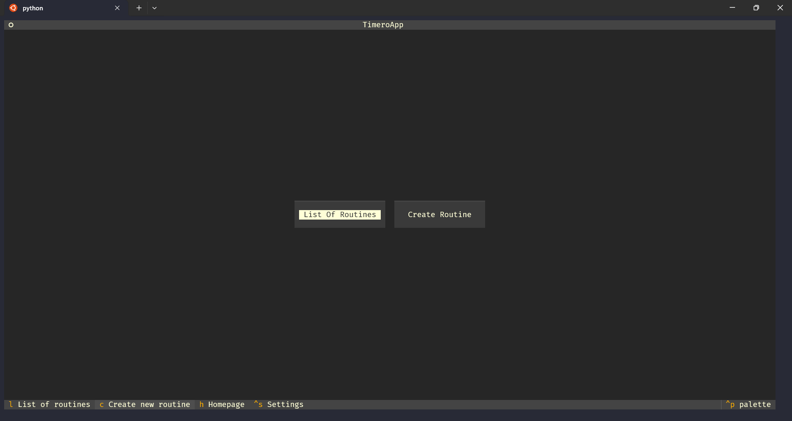


### Navigating the app

Press `ctrl+p` and choose `Show keys and help panel`.

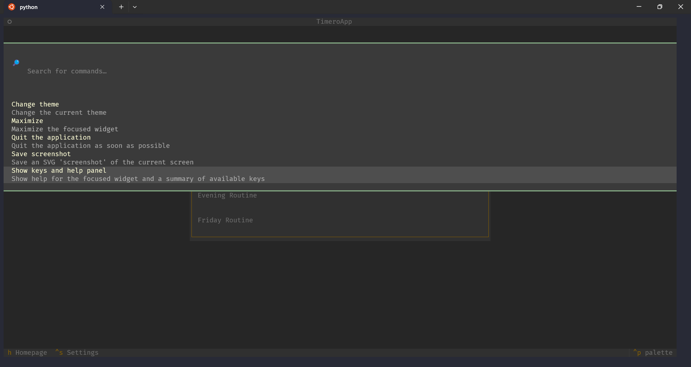

The panel with all available keys will pop up on the right.

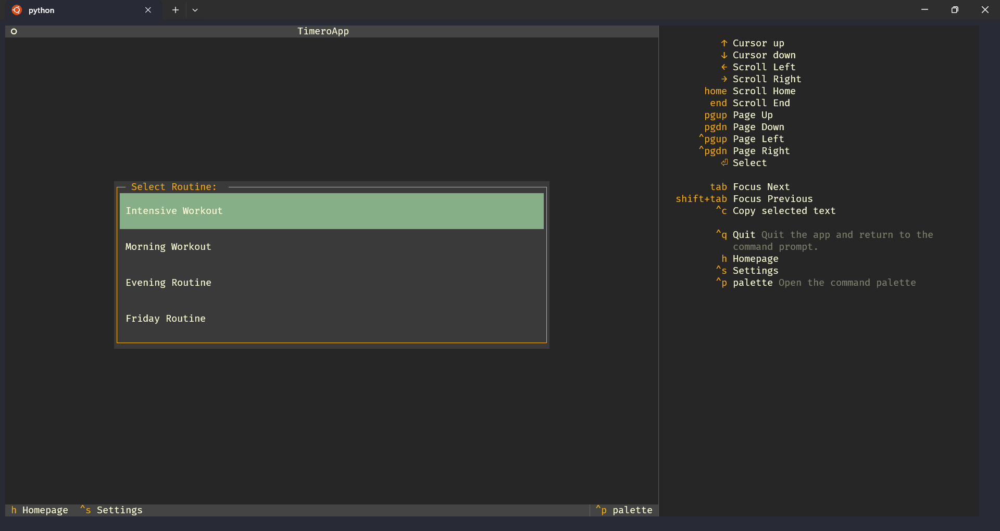

> _Note:_ You can also use the mouse for navigation.

### Exiting the app
To exit the app press `ctrl+q`. Or choose the `Quit the application` option from command palette (`ctrl+p`).

## Screenshots

### Routine Selection
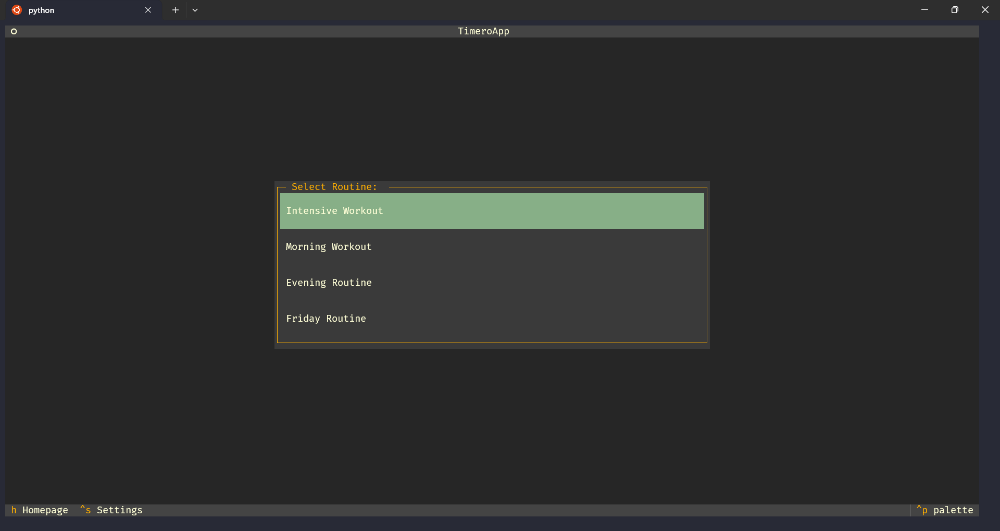

### Creating New Routine
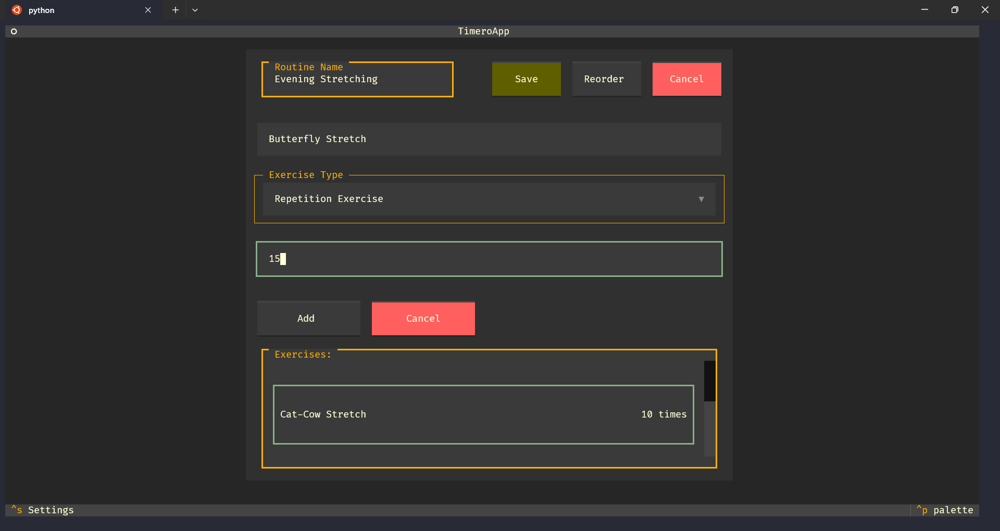
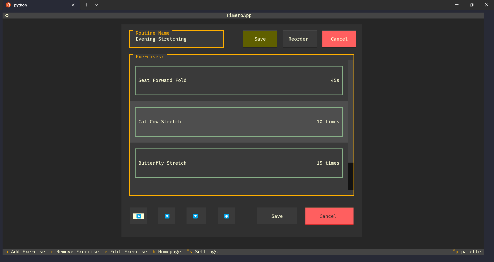

### Editing Exercise
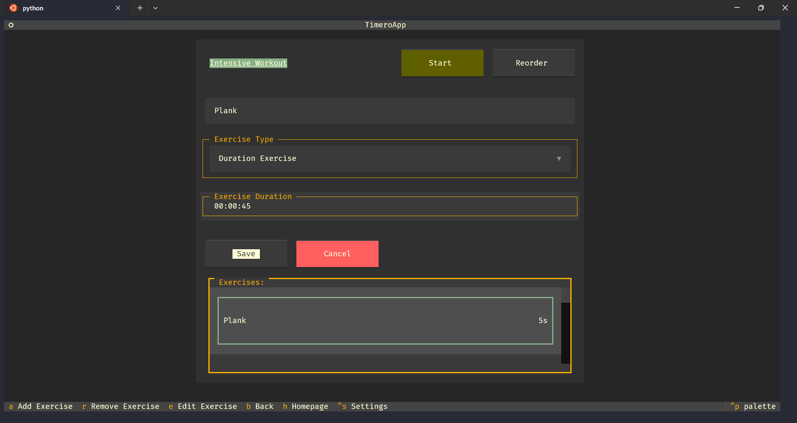

### Workout Session
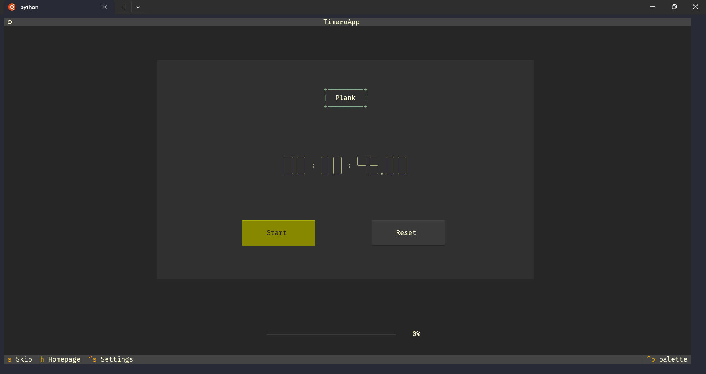
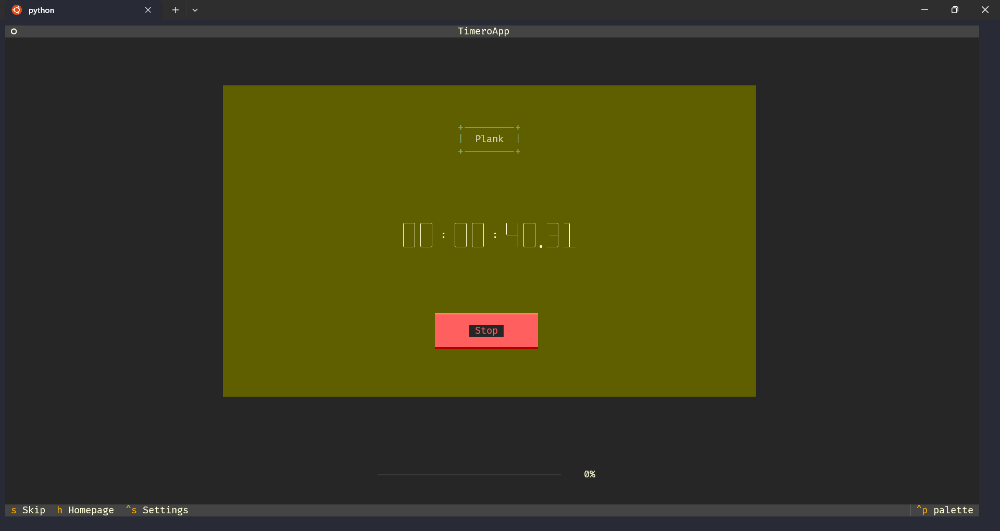
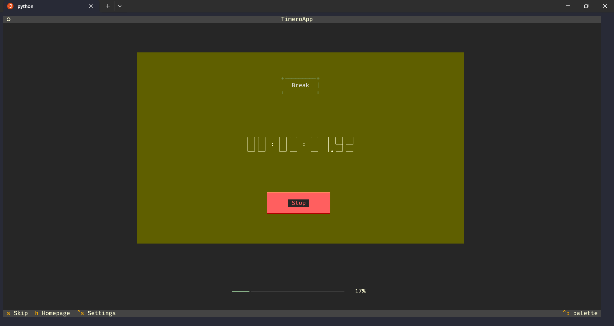
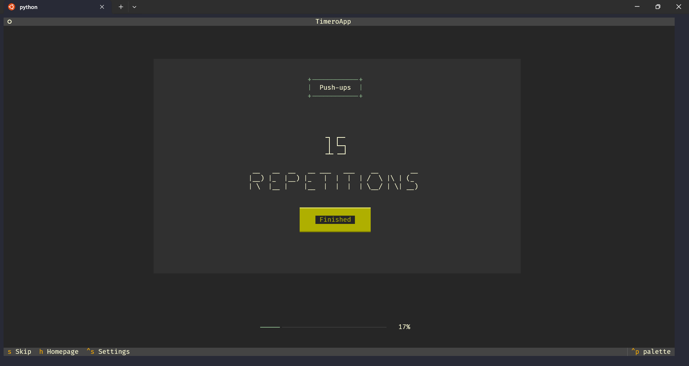
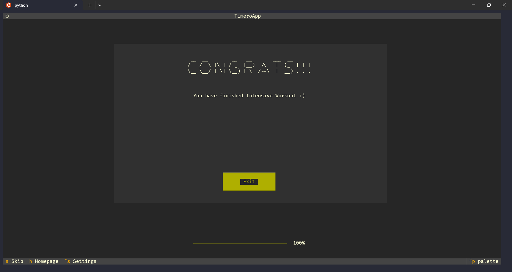


### Settings
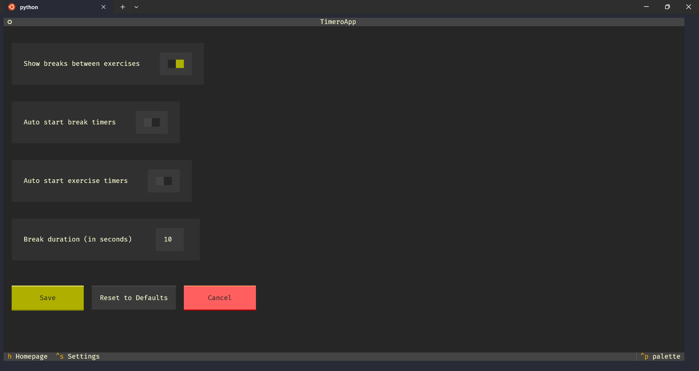

## FAQ

**I don't like the autostart timers feature. Can I disable it?**

Yes, you can. Go to your settings (`ctrl+s`) and turn off what bothers you.

**Are the breaks between exercises necessary?**

No, you can turn them off in your settings.

**Can I save my workout routines?**

Yes! Timero stores your routines in `routines.json` file, so you can access them anytime.